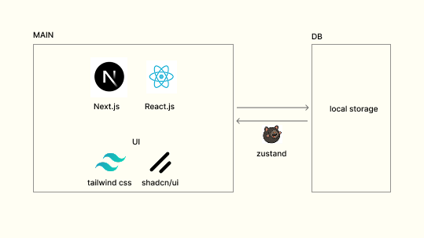
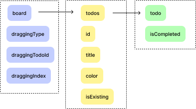
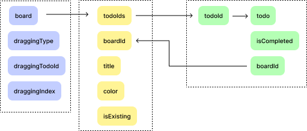

```js
칸반보드 형식의 todo-app입니다.
```

---

### 구조

<div align="center">

</div>

---

### boar 관련 동작

<div align='center'>
<p align="center">생성</p>

<br/>
<p align="center">삭제</p>

<br/>
<p align="center">수정</p>

<br/>
</div>

---

### todo 관련 동작

<div align='center'>
<p align="center">생성</p>

<br/>
<p align="center">완료</p>

<br/>
<p align="center">수정</p>

<br/>
<p align="center">이동</p>

<br/>
<p align="center">삭제</p>

<br/>
</div>

---

### 특징

#### 1. 로컬스토리지 사용

- noSql이나 sql을 사용할 경우 사용자가 todo상태를 바꾸거나 할일 위치를 바꿀 경우 서버요청이 과도하게 발생할 수 있다 판단했습니다.
- 이 경우 서버에서 문제가 생길 수 있어, 차라리 브라우저에서 관리하도록 했습니다.
- 세션스토리지의 경우 창을 끄면 저장내용이 초기화됩니다.
- 보통 3~7일 단위로 계획을 세우기 때문에 접속할 때마다 새롭게 kanban 보드를 작성할 경우 불편함을 줄 수 있다 판다해서 LocalStorage를 선택했습니다.

---

#### 2. 로컬스토리지 설계

<div align="center">

</div>
<br />

- 처음에는 한 스토어에서 상태를 모두 관리하려고 했습니다.
- 이 경우 직관적이긴 하나 todo 상태와 board의 상태의존성이 높아집니다.
- 그리고 중첩 객체의 사용으로 todo하나를 수정하는데도 복잡해질 위험이 있습니다.

<div align="center">

</div>
<br />

- 그래서 todo는 object로 관리해서 O(n)의 시간 복잡도를 가지도록 수정했습니다.
- 이 경우 board에서 todo를 조회할 경우 O(n)의 복잡도를 가지며 각각의 책임을 분리할 수 있게 됩니다.

---

#### 3. 로컬스토리지와 동기화

- Drag and Drop 구현 시, 업데이트된 화면과 zustand의 저장 상태를 동기화 해야 했습니다.
- 그래서 onDrop 이벤트 발생과 onDrag 이밴트 발생 시, 이벤트 처리에 대해서 많은 고민을 했습니다.
- 특히, zustand 상태를 업데이트하는 부분에서 중첩 객체가 많이 사용되어, 불변성 유지할 경우 가독성이 더 떨어질거라 판단해 immer를 사용했습니다.
- 다만 이 경우 action을 객체로 분리해서 관리할 경우 action 타입을 인식 못하는 버그가 발생해서 한 스토어 내에서 모두 관리했습니다.

---

#### 4. 드래그앤 드랍 직접 구현

- 다른 라이브러리를 사용할 경우 좀더 쉽게 구현할 수 있었으나, 저는 localStorage를 선택하면서, 이 저장소에 대한 의존성이 높아졌습니다.
- 그리고 타 라이브러리를 사용할 경우, 각각의 board내에서는 dnd를 쉽게 구현할 수 있으나 board사이에서 할일을 옮길 시 board 변화를 인식하지 못하는 버그가 발생했습니다.
- 또한 next.js 15버전은 react 19 버전을 사용하기에 호환성에도 문제가 있었습니다.
- 그렇기에 각각의 drop할 Node와 drag할 Node를 구분해서 DragEvent를 발생하도록 직접 구현했습니다.
- 이 경우 버블링 이벤트로 인한 중복 이벤트 발생에 주의를 기울이며 진행했습니다.
- 그와 동시에 LocalStorage상태와 항상 일치 시켜야 했기에 action과 state를 만들어 구분할 수 있도록 구현했습니다.
- 그리고 zustand의 경우 비동기로 진행되기 때문에 상태가 최신화되지 않는 문제도 발생했습니다.
- 이를 해결하기 위해 get함수를 통해 최신값을 바로 가져와서 사용할 수 있도록 수정했습니다.

---

#### 5. 폴더구조 캡슐화

- 평소 [Frontend Fundamentals](https://frontend-fundamentals.com/)를 보면서 리팩터링하기 위해 많은 고민을 했습니다.
- 구현 상세를 숨기고 추상화하는 것이 단순히 코드레벨이 아니라 폴더구조내에서도 진행되어야 한다고 생각했습니다.
- `<Boards />`에서 `<Todos />`를 불러와 사용할 경우, 폴더 내 파일구조를 알 필요가 없다고 생각합니다.
- 이 내용을 전체적으로 폴더구조 내에서 적용하기 위해 노력했습니다.

---

#### 느낀점

단순히 과제를 하는 것이 아니라 정말 제 친구들이 사용할 수 있는 페이지를 만들기 위해서 노력했습니다. 그러다보니 좀 더 편의성에 대해서 집중하였고, 어떻게 하면 친구들이 편리하게 사용할 수 있을까를 고민하면서 이벤트를 추가했습니다. <br /> 그와 동시에 어떻게 하면 동료 개발자가 읽었을 때 가독성을 높인 코드를 작성할 수 있는지 많은 고민과 함께 진행했습니다. <br /> 이 과제를 통해, 정말 많은 시행착오를 거치며 많은 배움을 얻었습니다. 좋은 기회 주셔서 감사합니다.
